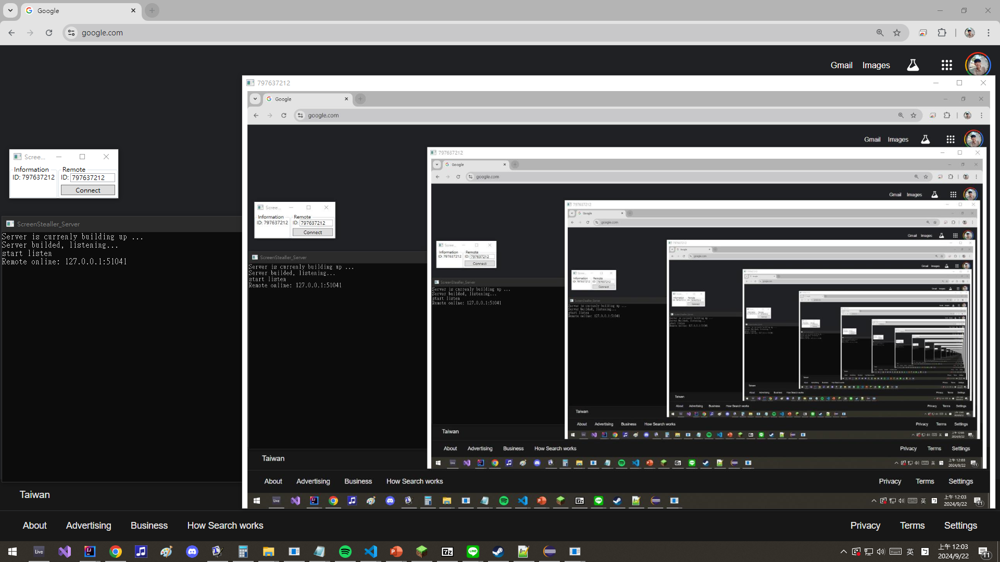

# 📌 ScreenStealer (Temporary Name)
*A Custom Implementation of Remote Screen Sharing & Control*

## 📖 Introduction
This project is a **custom implementation of a remote screen-sharing and control system**, similar to **TeamViewer**, but built with a focus on simplicity and educational value. It follows a **server-client architecture**, allowing users to connect to a remote machine using a unique **ID-based authentication system** and interact with the remote desktop in real-time.

The main functionalities include:
- **Live screen sharing** – Stream the desktop view of a remote machine.
- **Remote control** – Allow authorized users to interact with the remote computer.
- **Screenshot capture** – Capture and save remote desktop images.
- **Minimal setup** – Designed for ease of use with a straightforward connection mechanism.

> ⚠️ **This project is for educational and research purposes only.**  
> **Security features such as encryption are NOT included by default.**  
> **For commercial use, please implement necessary security enhancements.**

---

## 🏗 How It Works (Server-Client Model)
This project operates on a **server-client framework**, where:
- The **Server** runs on the target machine, continuously streaming screen data and responding to remote control inputs.
- The **Client** connects to the server using a unique **ID**, allowing it to view and interact with the remote desktop.

### 🔧 Key Technologies Used
- ✅ **Socket Programming** – Handles real-time data transfer between client and server.  
- ✅ **Multithreading** – Ensures smooth and responsive user experience.  
- ✅ **Image Processing** – Captures and transmits screen frames efficiently.  
- ✅ **Remote Input Handling** – Supports keyboard and mouse interactions.  

---

## 📸 Result Screenshot


---

## 🚀 Features
- 🔹 **Real-Time Screen Sharing** – View the remote desktop with minimal delay.  
- 🔹 **Remote Desktop Control** – Send keyboard and mouse commands to the target machine.  
- 🔹 **Screenshot Capture** – Take snapshots of the remote screen.  
- 🔹 **Customizable & Extensible** – Modify the code to suit your needs.  
- 🔹 **Lightweight Implementation** – Focused on simplicity and ease of understanding.  

---

## ⚠️ Security Notice
This project was developed as part of a **learning-based implementation**.
- **No encryption** is included in the current version.
- **Unsecured communication** means potential risks when used over the internet.
- **If used for production or commercial purposes, security enhancements are strongly recommended.**

---

## 🛠 Setup & Usage
### 🔹 Prerequisites
1. Install **Python 3.8+**  
2. Install dependencies:  
   ```sh
   pip install -r requirements.txt```
3.Run the server on the target machine:
   ```sh
   python server.py```
4.Run the client and enter the remote machine’s ID to connect:
   ```sh
   python client.py```

## 🤝 Collaboration & GitHub Posting
This project was jointly developed by Wei-Han, Chen and Feng-Hao, Yeh.
After mutual discussion and agreement, we have both posted this project on our respective GitHub repositories.

## 📜 License
This project is open-source under the MIT License. Feel free to use, modify, and distribute it. However, if you plan to use it commercially, ensure that proper security measures are implemented.

